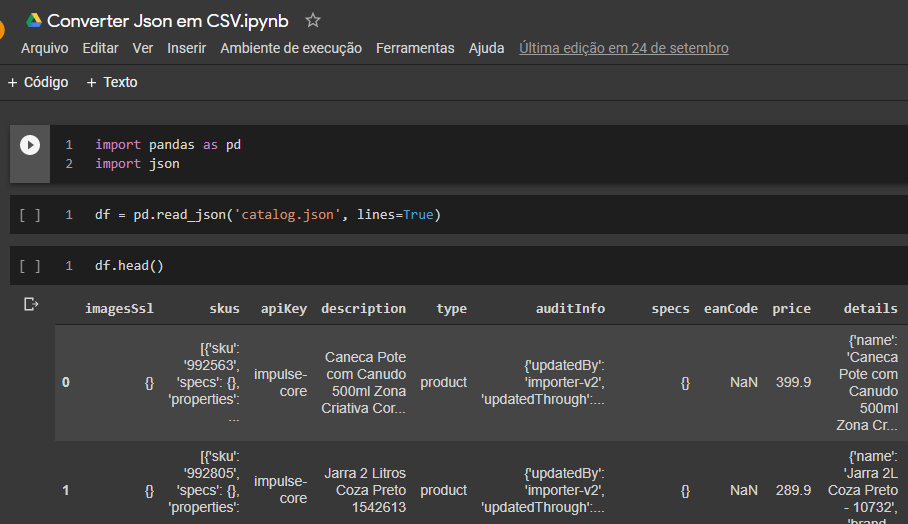

# DOCUMENTAÇÃO

# Projeto Desenvolvedor Fullstack - Desenvolvimento de duas API's Back-end e uma de Front-end

Projeto BackEnd utilizando a linguagem Node JS e banco de dados MySql com integração com o Insominia.

# Introdução

Projeto visa a criação de uma aplicação a ser desenvolvida para exibir as vitrines de recomendação em um site.

# Getting Started

Requesisto do Ambiente

1. Prepare seu ambiente de Desenvolvimento instalando o [Node Js](https://nodejs.org/pt-br/download/)

2. Instale o [MySQL](https://dev.mysql.com/downloads/installer/);

# Ambientes de desenvolvimentos

- [Visual Studio Code](https://code.visualstudio.com/): IDE para realizar o desenvolvimento do projeto.

- [Insomnia Core](https://insomnia.rest/download/): Para consultar as API 

# Estruturação do Projeto

- API para consulta de produtos no formato compacto e completo:

  - [GET](http://localhost:4000/produto/16910) - Lista produtos no formato compacto.

  - [GET](http://localhost:4000/produto/15893/FULL) - Lista produtos no formato completo.

#

- API para consulta de produtos recomendados em oferta:

  - [GET](http://localhost:4001/produtorec/15893) - Lista produtos em oferta.

  - [GET](http://localhost:4001/produtorec/15893/10) - Lista produtos em oferta com indicação de quantidade de registros.

# Conversão do arquivo Json para importação no banco de dados

